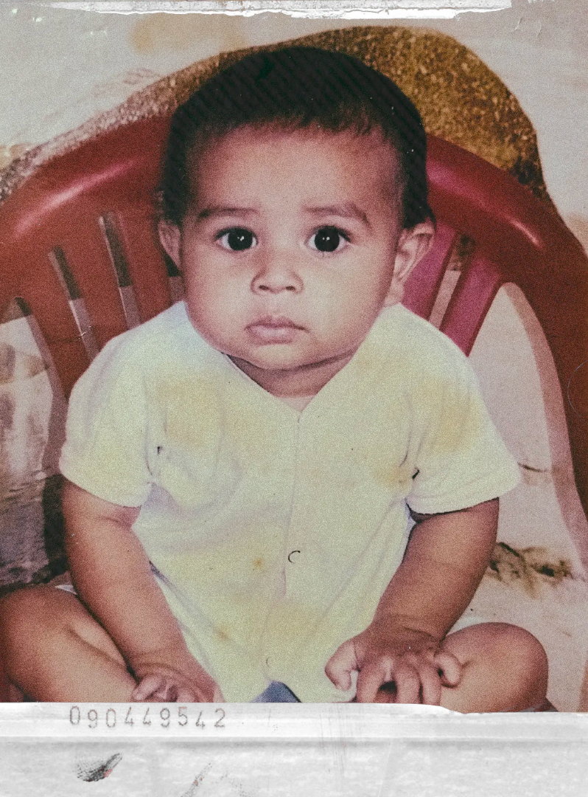

 

*I started with biology. Switched to code. Never looked back.*

*My first HTML file was written in Brackets in 2021, when I was 17 — before I even knew what a framework was.*

*Now I'm pursuing a Master's in Computer Science, buldings things that solves problems*

*The journey from biology textbooks to fullstack apps taught me one thing: the best decisions often look like mistakes at first.*

 

---

## Now

**Building [Frameshift](https://frameshift-client2-jet.vercel.app/)** — A migration tool that moves your Django projects to Flask. Because switching frameworks shouldn't be a nightmare.

**Building [Invozy](https://invozyapp.netlify.app/)** — Clean, simple invoicing software for businesses.

**Building [X-not-ex](https://x-not-ex.netlify.app/)** — An X (Twitter) clone, rebuilt with the features it should've had.

**Building** a beauty service marketplace — connecting clients with local beauty professionals. *(name TBD)*

---

## Background

- Started coding in **2021** at 17, first language: HTML, first editor: Brackets
- Switched from Biology to Computer Science mid-degree — best decision I ever made
- Currently pursuing **Master's in Computer Science & IT**

---

## Find me

[GitHub](https://github.com/fuzail) · [Email](fuzelxr@gmail.com) · [Website](fuzailmansuri.com)
